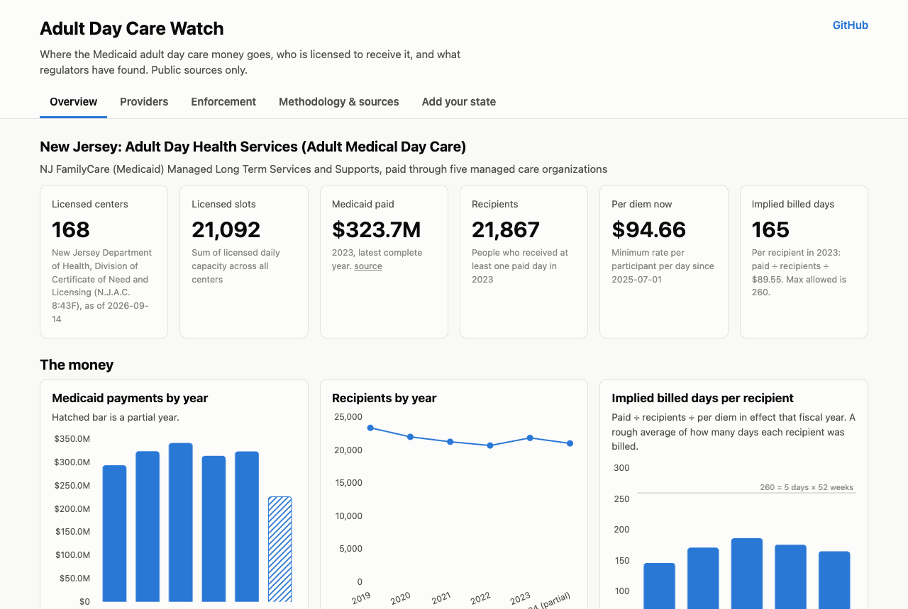

# Adult Day Care Watch

**Live site: https://jpatel3.github.io/adult-day-care-watch/**

Where the Medicaid adult day care money goes, who is licensed to receive it, and what regulators have found. One folder per state, public sources only, no build step. New Jersey is the first state. Fork it and add yours.



## What you get for a state

- **Overview**: statewide Medicaid payments and recipients by year, implied billed days per recipient, the per diem rate history, spend by managed care plan, and a plain-language explanation of how centers get paid and what is not public.
- **Providers**: every licensed center with address, phone, email, administrator, licensed owner entity, ownership type and licensed slots. Filter by county, owner type and flags; search; sort; map; download the filtered CSV. Click a row for every column and any matched enforcement action.
- **Enforcement**: settlement agreements, overpayment notices and licensing orders, with links to the agency PDFs.
- **Worth a look** flags, computed from public columns: no NPI at the address, past enforcement action, owner holds multiple licenses, top 10% by slots, license date passed or near. Facts, not accusations.
- **Methodology & sources** and **Add your state**.

## New Jersey in five lines

1. 168 licensed centers, 21,092 licensed slots, concentrated in Middlesex, Bergen, Passaic, Essex and Monmouth counties (NJ Department of Health roster, Sept 2026).
2. Medicaid paid $324M in 2023 for 21,867 recipients, up from about $195M and 14,000 recipients in 2013. The per diem barely moved in that time; the growth is volume ([NJ Comptroller deck, slides 11-13](https://www.nj.gov/comptroller/library/Resources/AMDC_Provider_Training12_04_2024.pdf); [2013 report](https://nj.gov/comptroller/news/docs/report_mfd_investigative_adc_03_06_13.pdf)).
3. The 2013 Comptroller investigation found billing for participants who were on vacation or never attended, and no sign-in signatures on 133 of 228 sampled claims. The 2023 audit of all claims 2016-2022 found $946K of computer-detectable errors at 21 centers, about 0.05% of payments ([report](https://www.nj.gov/comptroller/reports/2023/20231031.shtml)).
4. HHS OIG, Dec 2025: all 20 centers visited were out of compliance; most had not been inspected by the state since before 2020 ([A-02-24-01009](https://oig.hhs.gov/reports/all/2025/new-jersey-did-not-ensure-providers-complied-with-federal-and-state-requirements-at-all-20-adult-day-health-services-facilities-audited/)).
5. Per-provider Medicaid payments are not public. An OPRA request template is in the "Add your state" tab.

## Repo layout

```
index.html, app.js, styles.css, flags.js   the viewer (no build; flags.js holds the flag rules)
states/index.json                          which states exist
states/nj/                                 config.json, providers.csv, npi_registry.csv, enforcement.csv, sources/
states/_template/                          copy this to start a new state; HOWTO.md walks through it
scripts/                                   data pipeline, validator, tests, smoke test
methodology.md                             column dictionary, formulas, flag rules, public-records guidance
```

## Run locally

```bash
python3 -m http.server 8000      # then open http://localhost:8000/?state=nj
python3 scripts/validate.py      # data contract check (also runs in CI)
npm install && npm test          # flag unit tests + headless smoke test (needs Google Chrome)
```

## Add your state

Read [`states/_template/HOWTO.md`](states/_template/HOWTO.md) (also rendered in the site's "Add your state" tab) and [`CONTRIBUTING.md`](CONTRIBUTING.md). Roughly: find the licensing roster, the Medicaid per diem, statewide spending, and enforcement actions; run the NPI script; fill the CSVs and `config.json`; run the validator; open a pull request. Or fork and publish your own copy with GitHub Pages, no build needed.

## Where to share work like this

The repo and site are the canonical home; everything else links back. Good places to send a finished state: [Data Is Plural](https://www.data-is-plural.com/) (dataset newsletter), [MuckRock](https://www.muckrock.com/) (file the public records request there so others can follow it), your state's nonprofit newsroom and public radio Medicaid reporters, the local [Code for America brigade](https://brigade.codeforamerica.org/) or open data meetup, [IRE](https://www.ire.org/) for the multi-state angle, and, if you find something concrete rather than a pattern, your state Comptroller or Medicaid Inspector General.

## License

Code is MIT ([LICENSE](LICENSE)). Compiled data is CC0 ([LICENSE-DATA](LICENSE-DATA)); the underlying records belong to the agencies that published them.

## Disclaimer

This is a public-data project. Flags are facts computed from published columns and are labeled "worth a look." Nothing here is an accusation against any person or business, and nothing is legal advice. Corrections welcome as issues or pull requests with a source.
